# Part 1. HYPERVISORS

## What are the most popular hypervisors for infrastructure virtualization?
* VMware vSphere Hypervisor,
* Microsoft Hyper-V,
* Citrix XenServer,
* Oracle VirtualBox, 
* Red Hat Enterprise Virtualization Hypervisor (REVH),
* KVM,
* Parallels,
* Qemu.

## Briefly describe the main differences of the most popular hypervisors.
1) **VMware VSphere Hypervisor**:

	+ Small Footprint
	+ User-Friendly

2) **Microsoft Hyper-V**:

	+ Portability
	+ Remote Connectivity
	+ Backup and Recovery

3) **Oracle VirtualBox**:

	+ Flaxibility
	+ Free

4) **KVM**:

	+ Remote Networking Management with BIOS access
	+ Remotely Access Both Computers and Virtual Machines SimultaneouslyA

---

# PART 2. WORK WITH VIRTUALBOX

## First run VirtualBox and Virtual Machine (VM)
### 1.1 - 1.5)
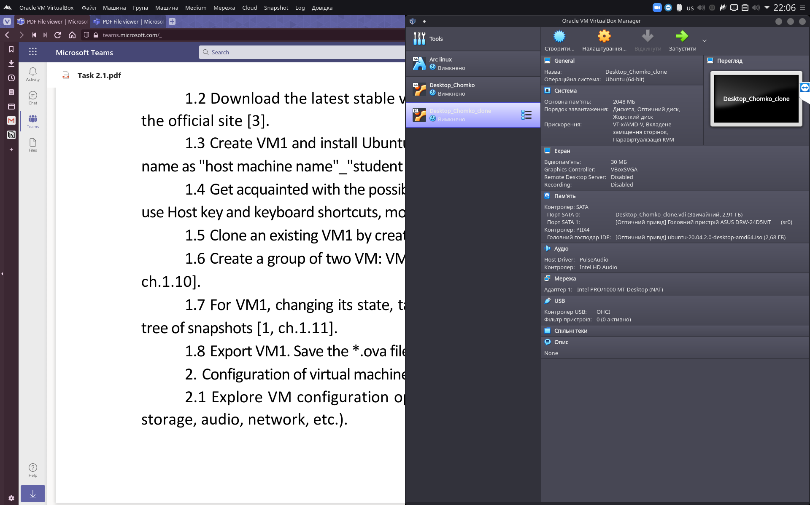

### 1.6)
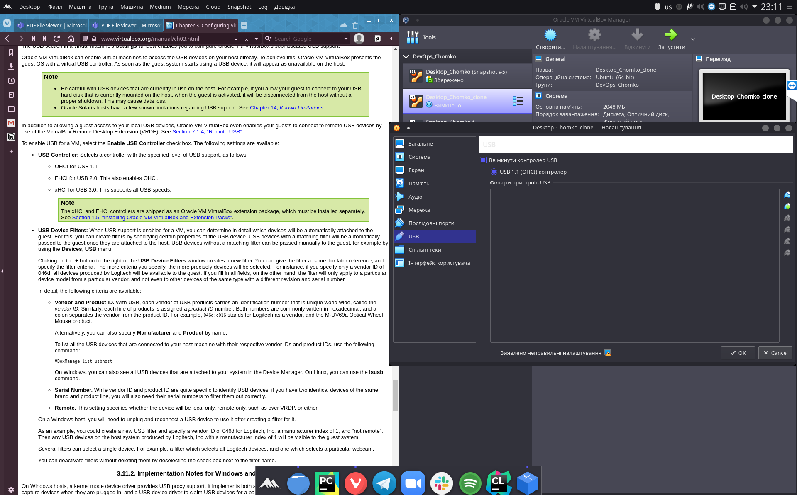

### 1.7)
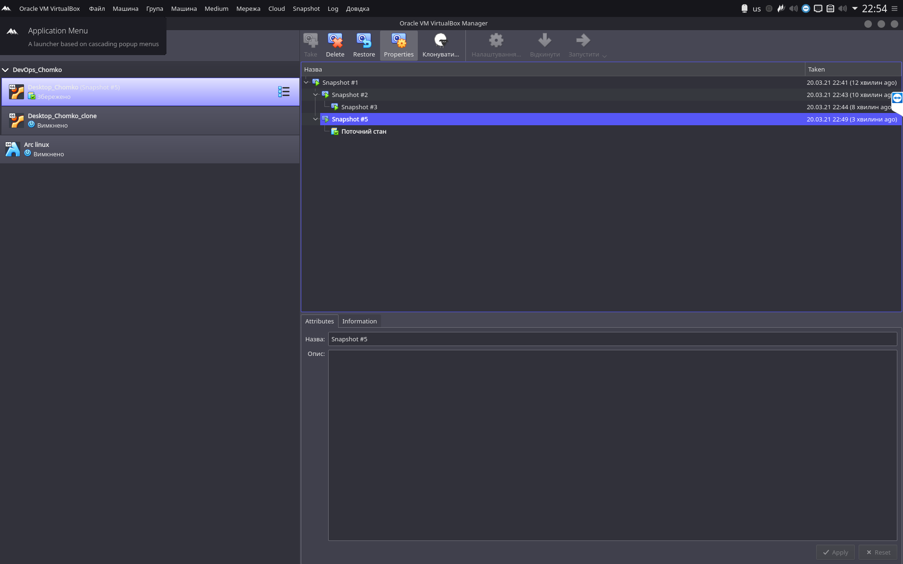

### 1.8)
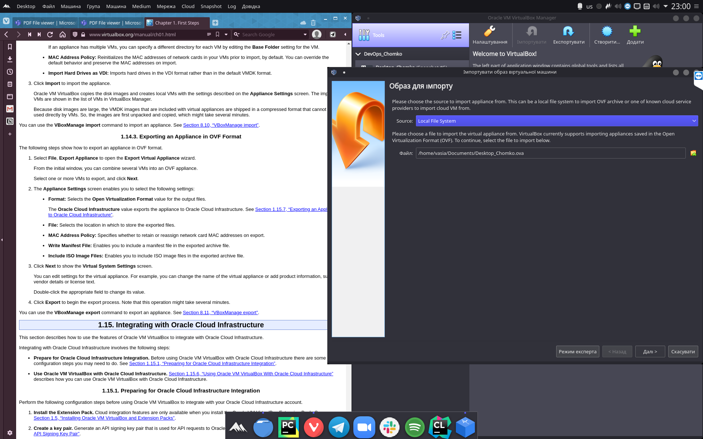

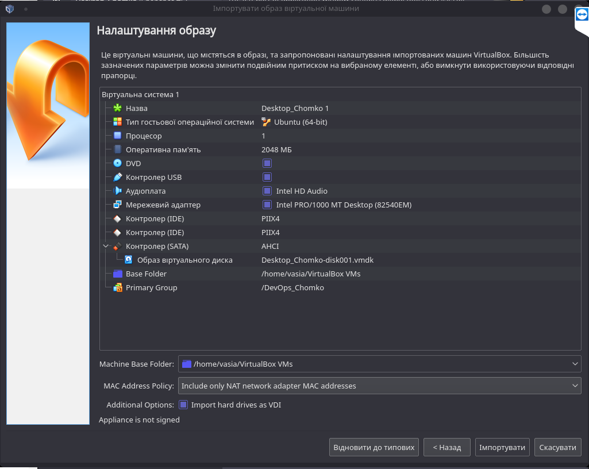

## Configuration of virtual machines
### 2.1 - 2.2)

### 2.3)
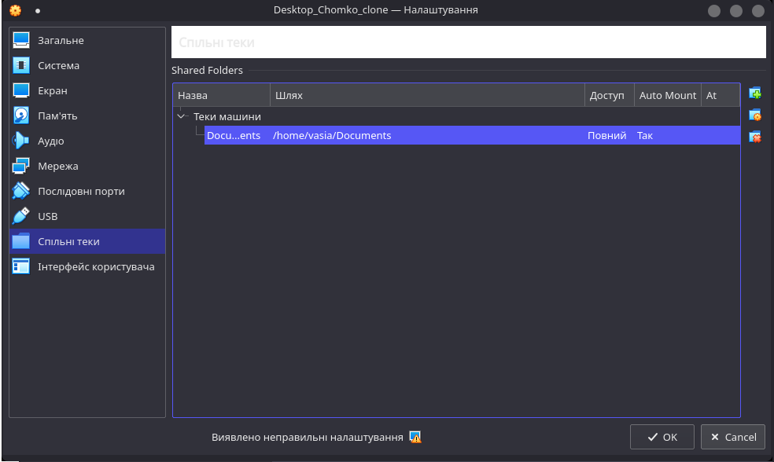

### 2.4)

| Mode		| VM -> Host	| VM <- Host	| VM1 <-> VM2	| VM -> Net/LAN	| VM <- Net/LAN	|
| :-----------: | :-----------: | :-----------: | :-----------: | :-----------: | :-----------: |
| Host-only 	| +		| +		| +		| -		| -		|
| Internal	| -		| -		| +		| -		| -		|
| Briged	| +		| +		| +		| + 		| +		|
| NAT		| +		| Port forward	| - 		| +		| Port forward	|
| NAT service	| +		| Port forward	| + 		| +		| Port forward	|

 *As we can see, table of different network modes, given to us during the lecture is perfectly correct.*

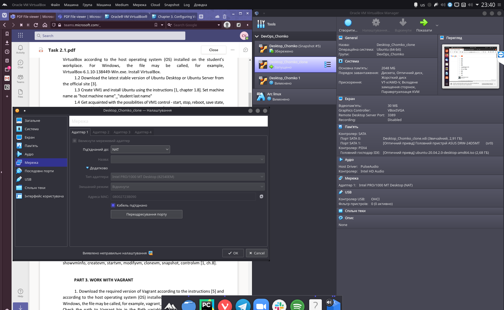

## Work with CLI through VBoxManagr

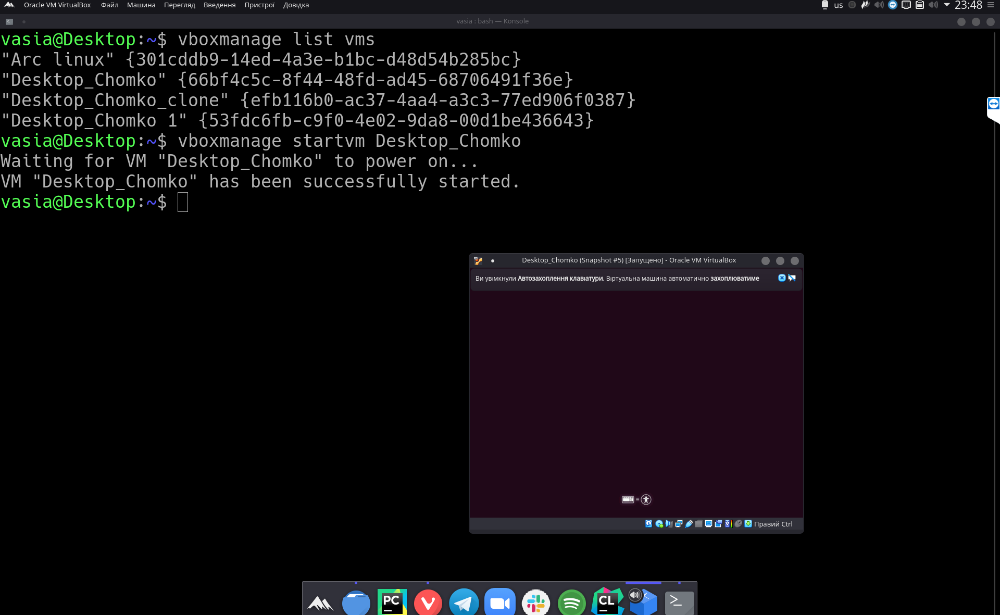

---

# PART 3. WORK WITH VAGRANT

## 1 - 3)

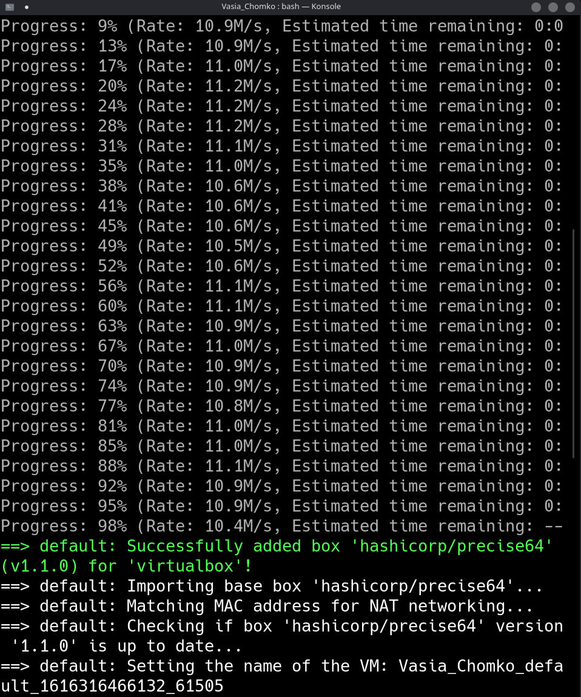

## 4)

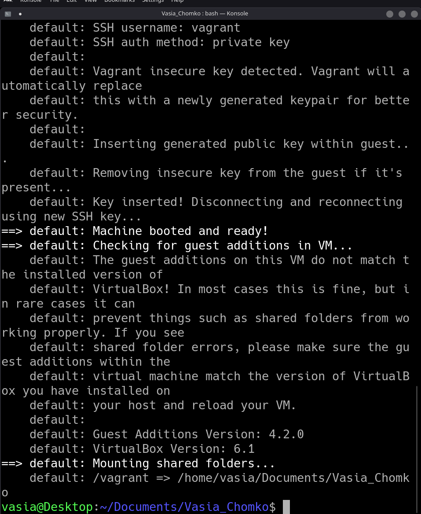

## 5 - 7)

*As I work on linux, I have no need to use any ssh emulators, I can use ssh itself.*
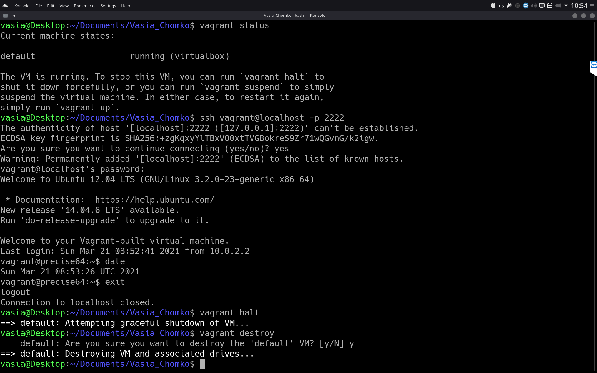

## 8)

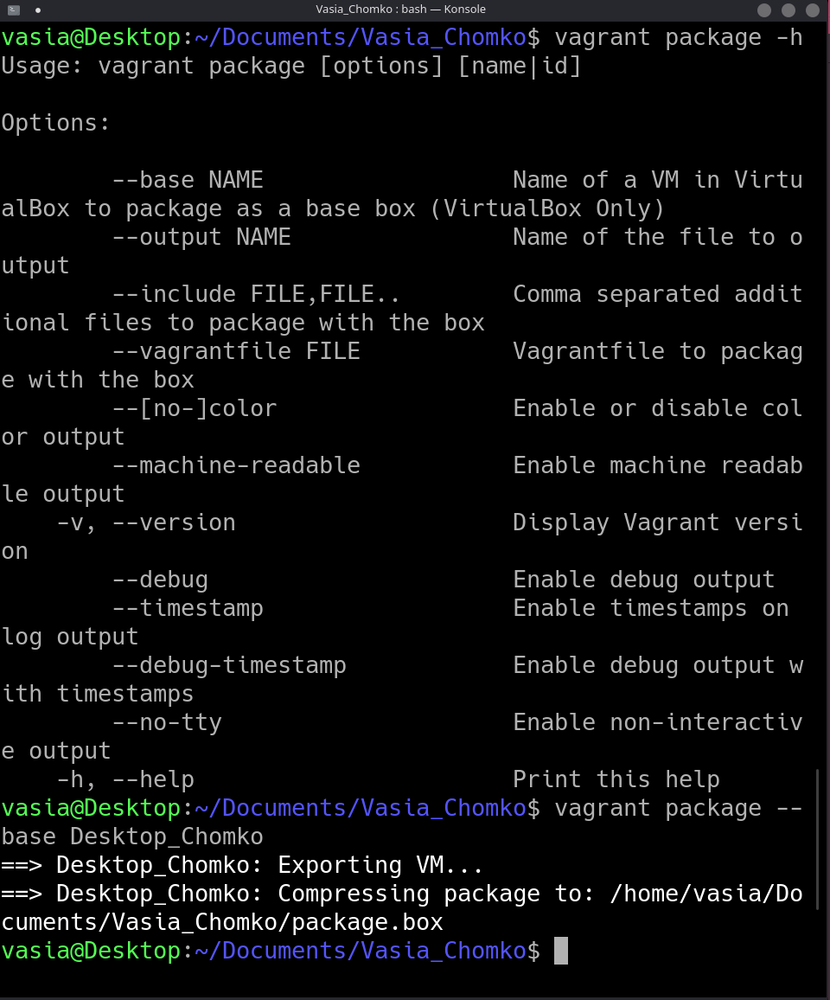

*P.s.*
> I have no possibility to install VBox on my local machine(because of dependencies/architecture incompatibility), so I connected via TeamViever to one of my work instances to make this task.
