# Virtualization and Cloud Basic

### 1 - 3)

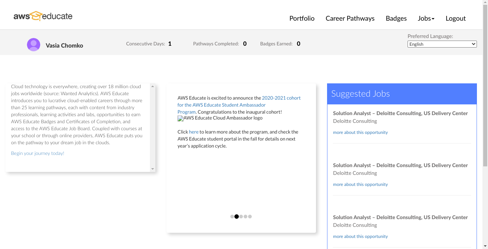

### 4)
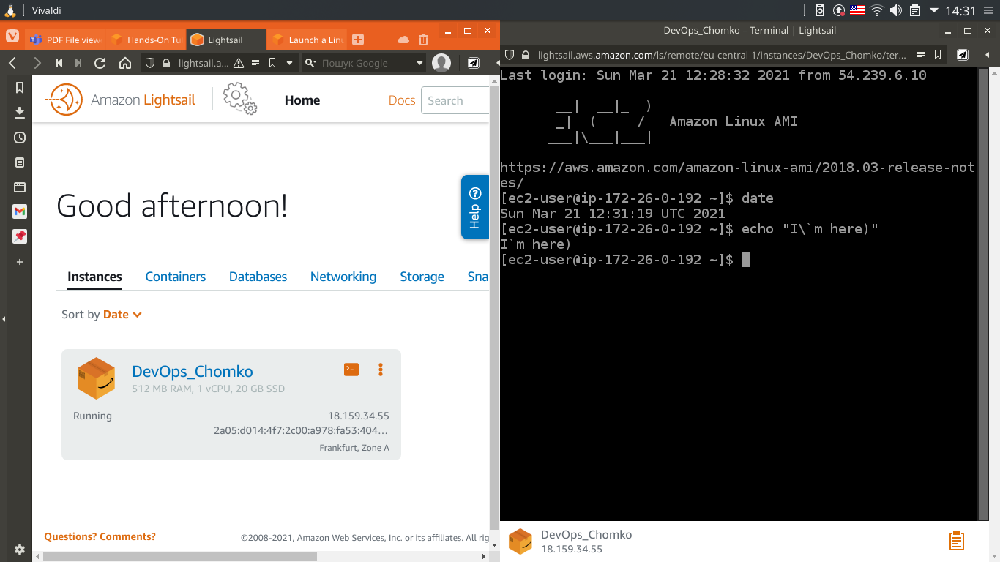

### 5)
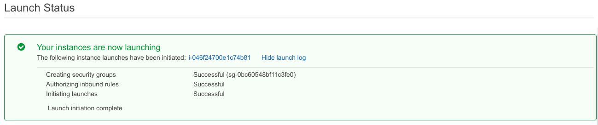

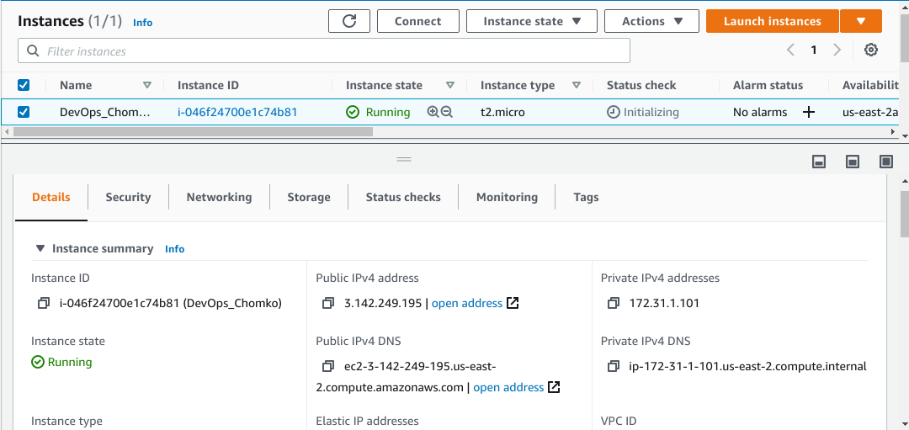

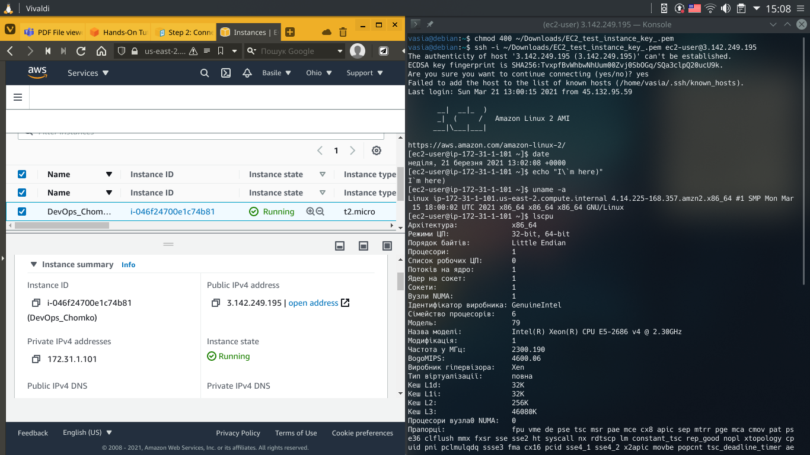

### 6)
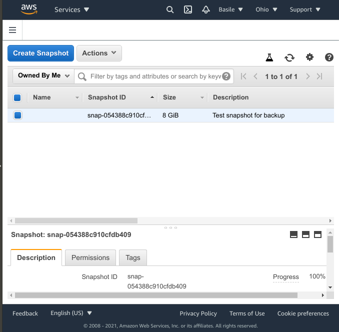

### 7)
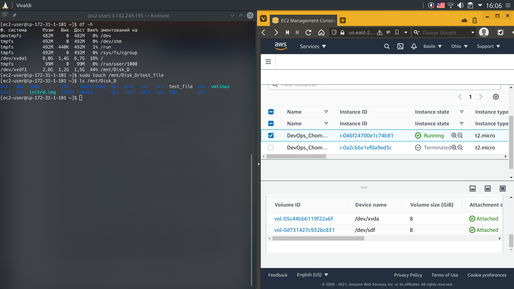

### 8 - 9)
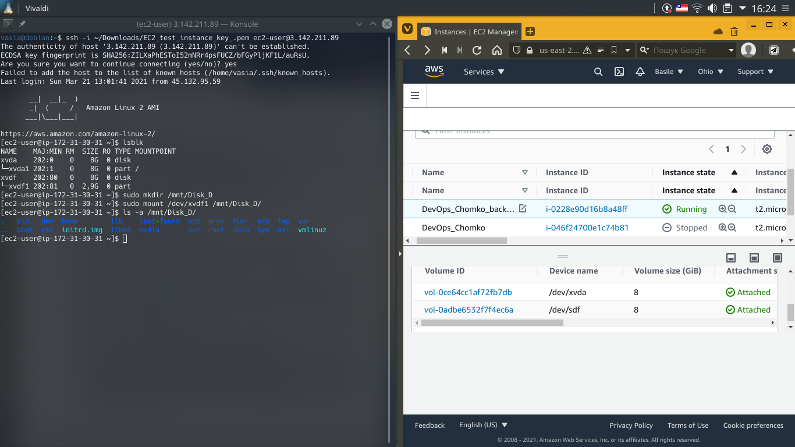

### 10)
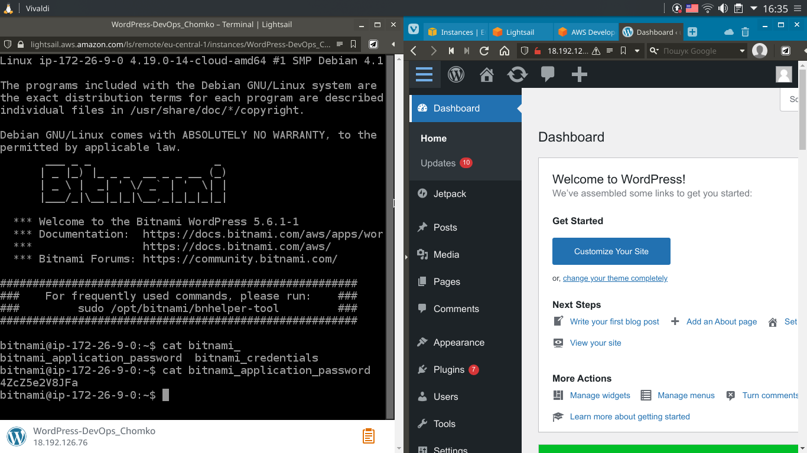

### 11)
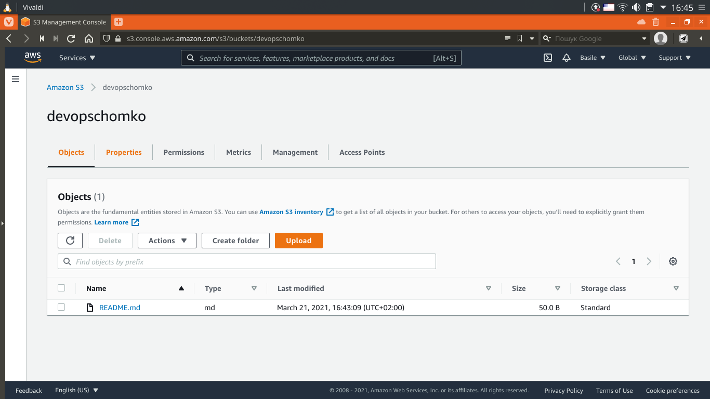

### 12)
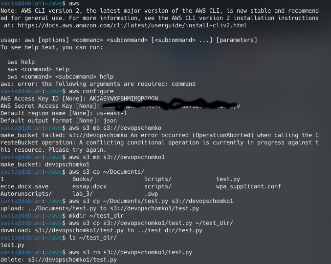

### 13 - 14)
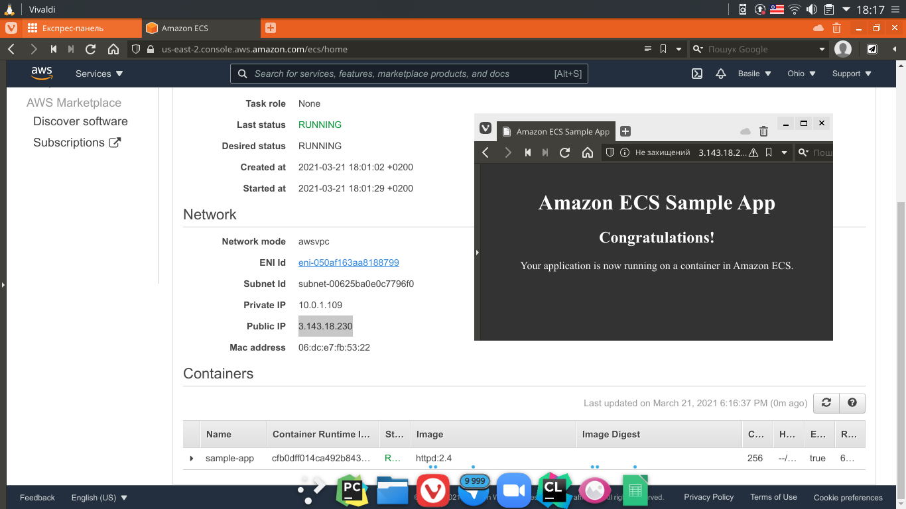

### 15)
Tap [_here_](http://devopschomkoforwebsitehosting.s3-website.us-east-2.amazonaws.com "Link to static site."), to open site.

