# Database Administraion

## PART 1
### 1.1 - 1.5)
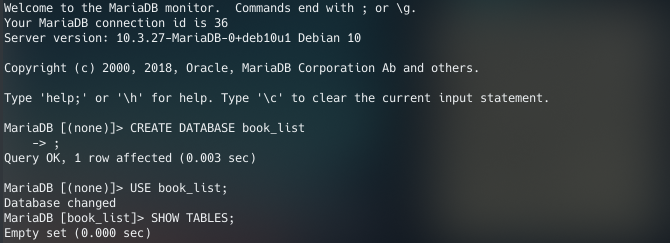
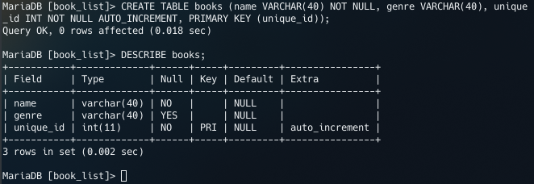
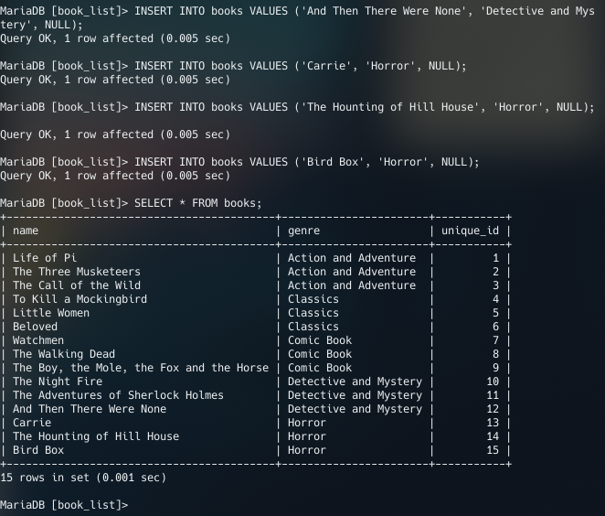
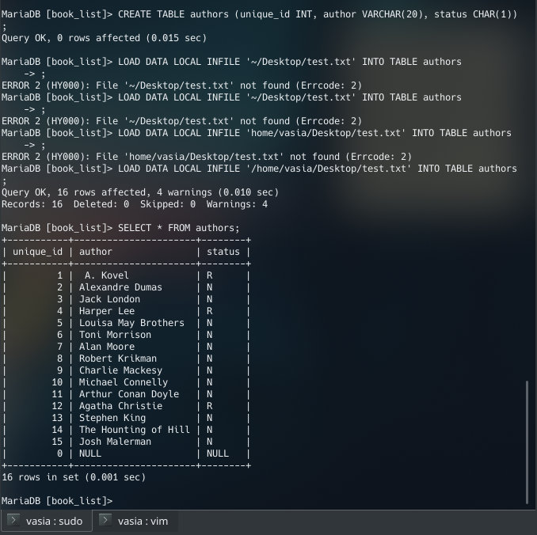
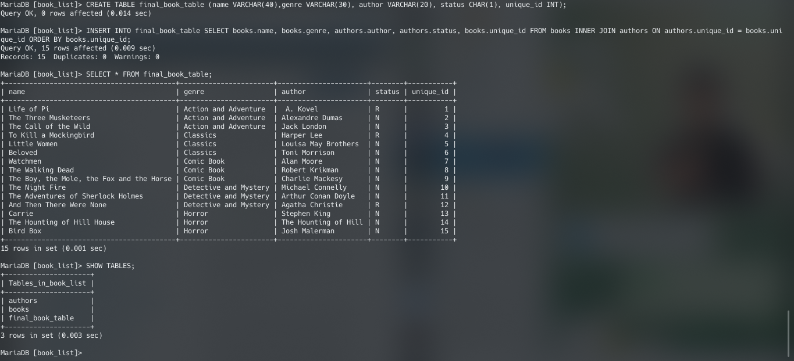
*Importing file structure:*

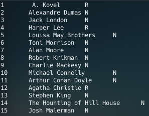

### 1.6 - 1.7)
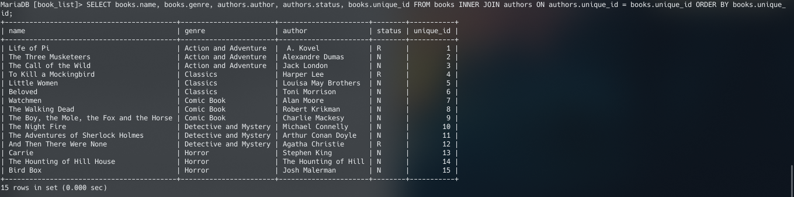
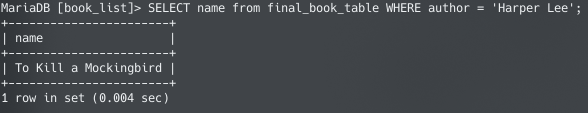
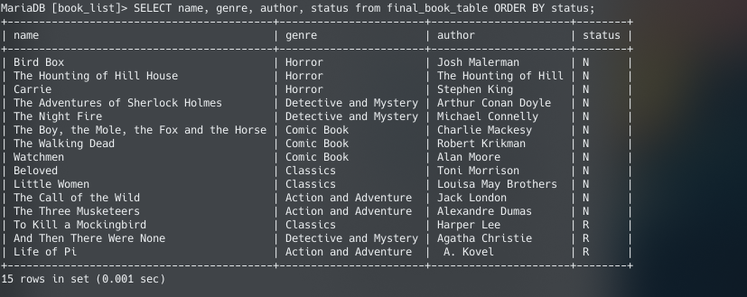

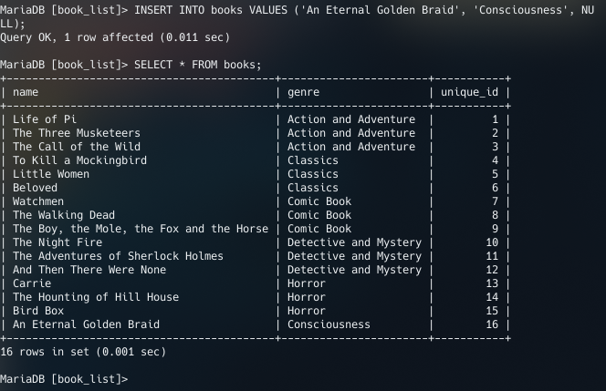

### 1.8)
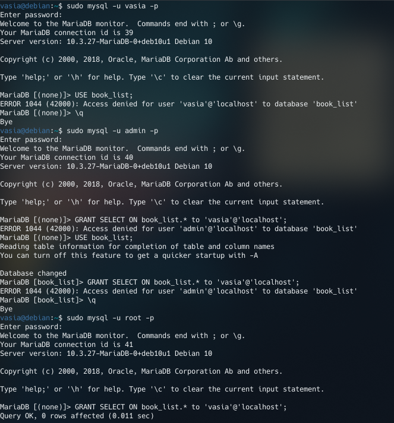

### 1.9)
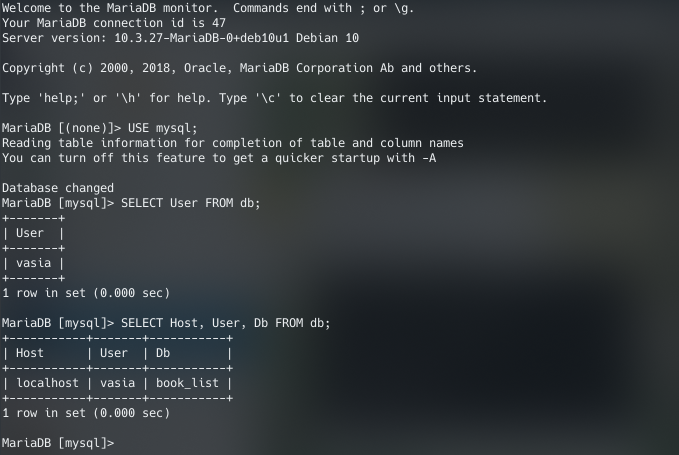

## PART 2
### 2.10 - 2.12)
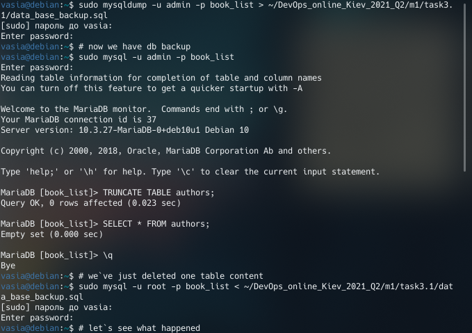
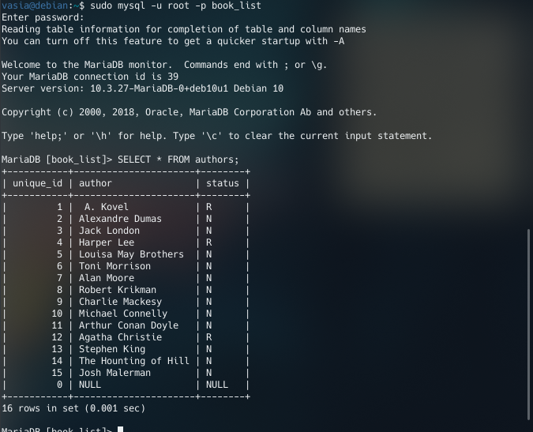

### 2.13 - 2.14)
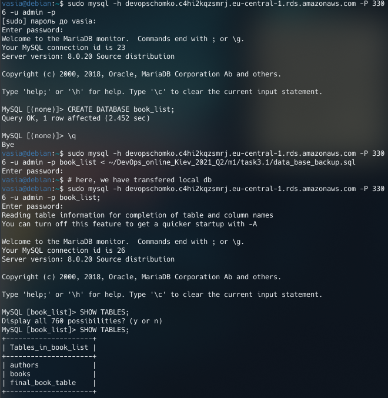

### 2.15)

### 2.16)
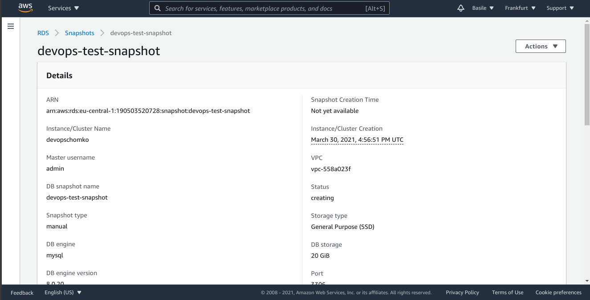

## PART 3
### 3.17)
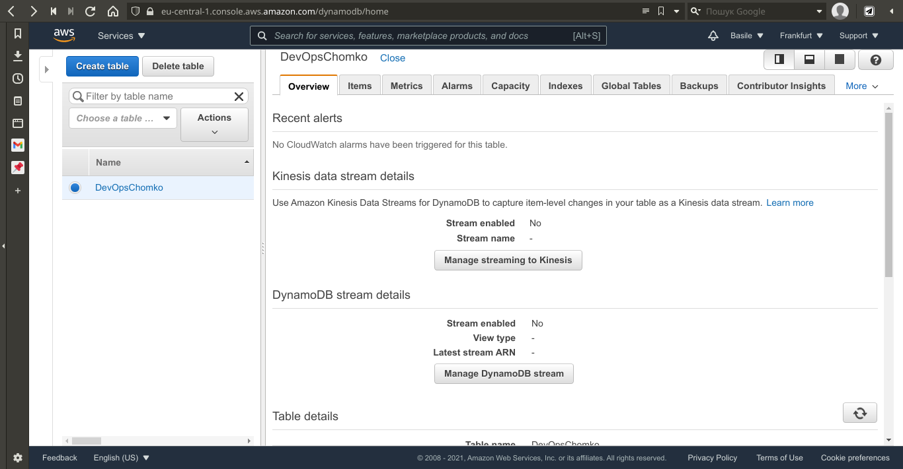

### 3.18)
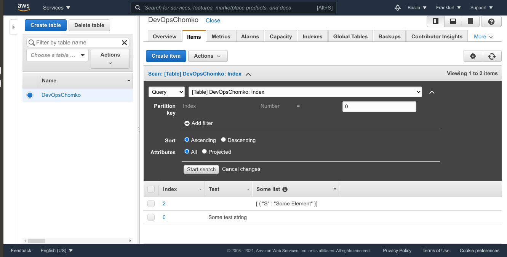

### 3.19)
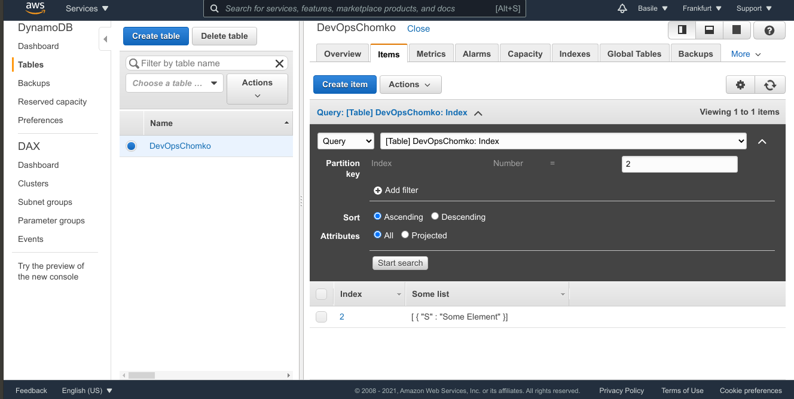

