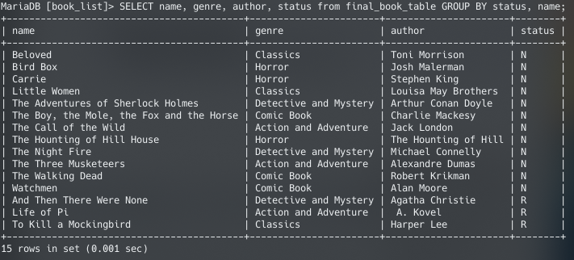
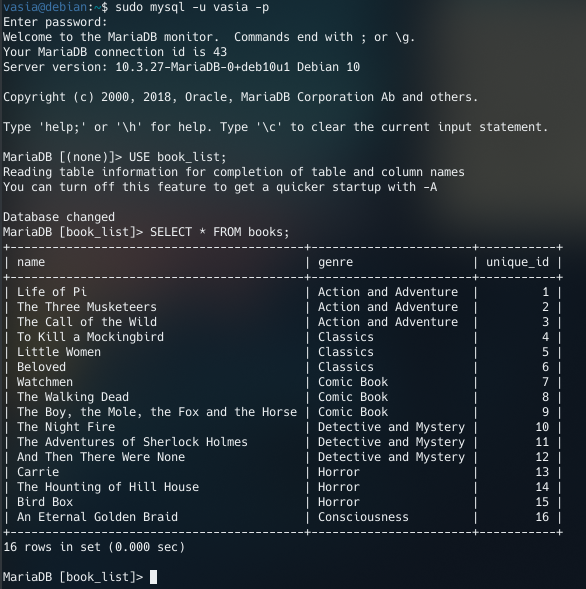
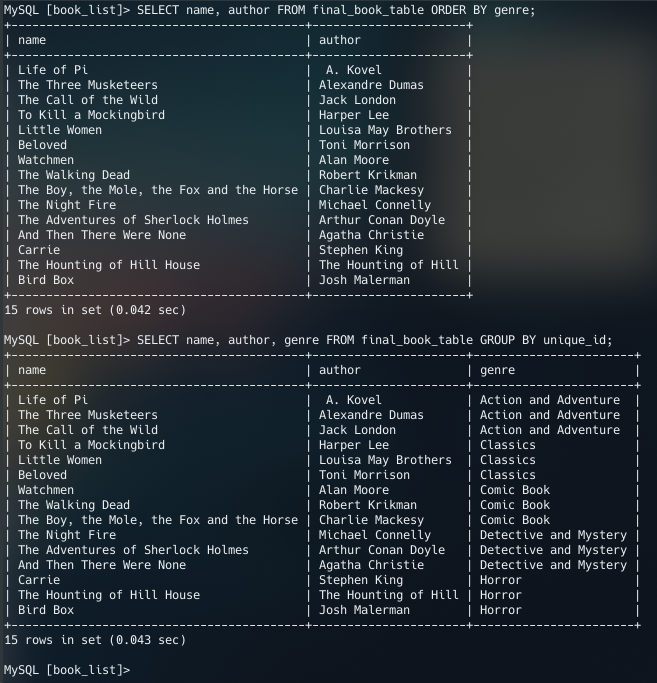

# Database Administraion

## PART 1
### 1.1 - 1.5)

*Importing file structure:*

### 1.6 - 1.7)

### 1.8)

### 1.9)

## PART 2
### 2.10 - 2.12)

### 2.13 - 2.14)

### 2.15)

### 2.16)

## PART 3
### 3.17)

### 3.18)

### 3.19)

