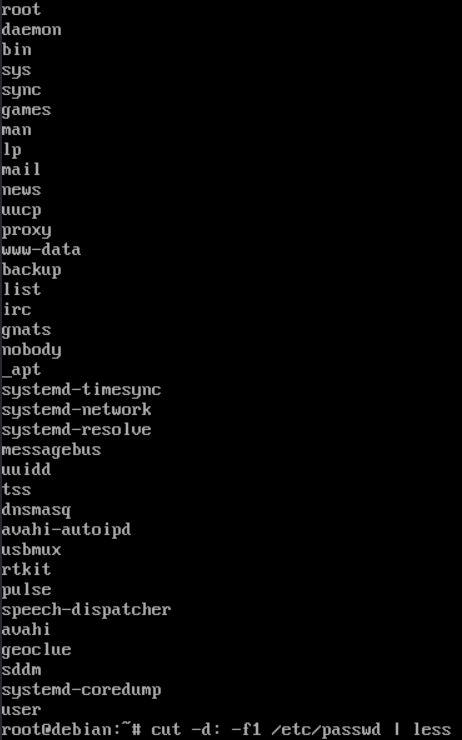
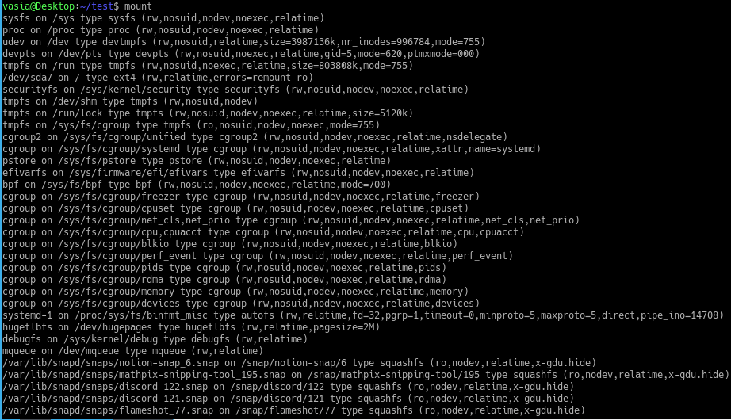
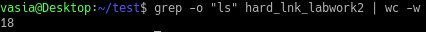
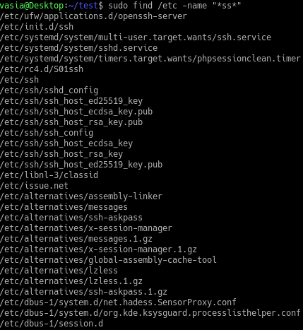
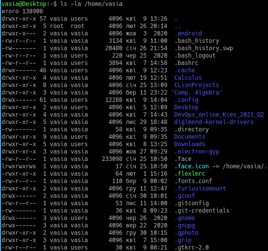

##
# Part 1

## 1 - 2) 

"System save password in /etc/shadow. So, we change directly it. "

## 3) 

## 4) 

## 5)

## 6) 
With less:

With more:

## 7) 

_Honestly, I've not understood what to do in this task, so just've read finger documentation._

## 8) 

# Part 2

## 1) 

## 2) 

## 3) 

## 4) 

## 5) 

## 6) 

## 7) 

## 8) 

## 9) 

## 10) 

## 11) 

## 12) 

_Honestly, I've not understood what to do in this task, so I might have done it wrong._

## 13) 
Generaly, there are a few types of them:
 1) Block devices
 2) Character devices
 3) Pseudo-devices (like /dev/null, /dev/zero, /dev/random, and a few more).

*P.s. Only b - block, c - character*

## 14) 

File types:
1) `-` : regular file
2) `d` : directory
3) `c` : character device file
4) `b` : block device file
5) `s` : local socket file
6) `p` : named pipe
7) `l` : symbolic link

## 15) 

