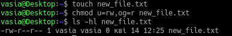

# Linux Essentials Task 5.2

## 1)

* /etc/passwd structure

	| Username	| Password	| UserID	| Group ID	| User ID Info |	Home Dir	| Command/shell	|
	| :-----------: | :-----------: | :-----------: | :-----------: | :----------: | :--------------------: | :-----------: |
	| sddm		| x		| 115		| 121	| Simple Desktop Display Manager | /var/lib/sddm | /bin/false	|
	| vasia		| x		| 1000		| 1000		| vasia,,,	| /home/vasia 		| /bin/bash	|

* /etc/group structure

	| Group name	| Password	| Group ID	| Group List	|
	| :-----------: | :-----------: | :-----------: | :-----------:	|
	| scanner	| x		| 127		| saned		|
	| pulse-access	| x		| 116		| vasia 	|

* Pseudo-users

	User examples:
	+ sddm
	+ lightdm
	+ tss
	
	To define pseudo-users, look at _Command/shell_ field, if it's `/bin/false`.

## 2)
* UID ranges
	+ 0..99    - statically allocated by the system					  `: Most systems`
	+ 100..499 - should be reserved for dynamic allocation 				  `: Most systems`
	+ 100..999 - reserves the range for dynamically allocated system users and groups `: Debian and some others`

_UID(user identifier)_ - a number assigned by Linux to each user on the system. This number is used to identify the user to the system and to determine which system resources the user can access.

To change UID util `usermod -u` is used, to create new user with new UID ulit `useradd`. 

## 3)

_GID(group identifier)_ -  a numeric value used to represent a specific group. The range of values for a GID varies amongst different systems; at the very least, a GID can be between 0 and 32,767, with one restriction: the login group for the superuser must have GID 0.

## 4)

## 5)

## 6)

## 7)

Directory `/etc/skel/` is used to initiate home directory when a user is first created.

## 8)

## 9)

## 10)

## 11)

* Columns explenation

	+ lrwxrwxrx : permissions and file type
	+ 1 : number of linked hard-links
	+ root : owner of the file
	+ root : to which group this file belongs to
	+ 7 : size
	+ Feb 26 07:08 modification/creation date and time
	+ bin -> usr/bin : file/directory name and file it linked to

## 12 - 13)

## 14)

## 15)

## 16)

If you set the sticky bit to a directory, other users cannot delete or rename the files (or subdirectories) within that directory.

When the sticky bit is set on a directory, only the owner and the root user can delete / rename the files or directories within that directory.

## 17)

