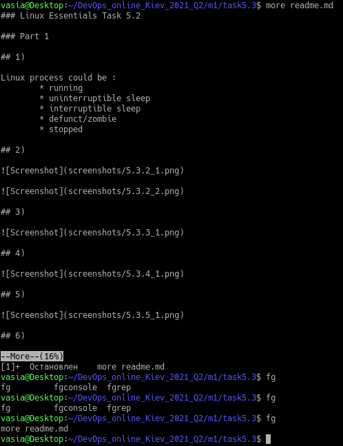

# Linux Essentials Task 5.2

# Part 1

## 1)

Linux process states could be:

+ running
+ uninterruptible sleep
+ interruptible sleep
+ defunct/zombie
+ stopped

## 2)

## 3)

## 4)

## 5)

## 6)

## 7)

| Field	| Description					|
| :---: | :-----------: 				|
| USER	| User login name				|
| PID	| Process ID					|
| PPID	| Parent process ID				|
| C	| CPU utilization of process			|
| STIME	| Start time of process				| 
| TTY	| Contolling workstation for the process	| 
| TIME	| Total execution time for the process		|
| CMD	| Command					|

## 8)

## 9)

## 10)

| Field	| Description					|
| :---: | :-----------: 				|
| PID	| Process ID					|
| PR	| Priority of the task				|
| SHR	| The amount of shared memory used by a task	|
| VIRT	| Total virtual memory used by the task		|
| USER	| User name of owner of task			|
| %CPU	| The CPU usage					| 
| TIME+ | CPU Time					| 
| SHR	| The Shared Memory size (kb) used by a task	|
| NI	| Represents a Nice Value of task		| 
| %MEM	| The Memory usage of task			|

## 11)

## 12 - 13)

## 14)

Some processes may be highly CPU-intensive but not as important as others and hence can have a lower priority while others may or may not be highly CPU-intensive but are very important and hence should have higher priority.

For example- if there is a process A, which detects fraud with input data and there is another process B, which makes hourly backups of some data, then the priority(A) > priority(B)!

This ensures that if both A and B are running at the same time, A would be allocated more processing bandwidth.

*`nice` and `renice` command in Linux helps in execution of a program/process with modified scheduling priority*

## 15)

Yes, in top press `r`.

## 16)

## 17)

# Part 2

## 1)
Let's try standart ssh call `ssh username@host`. Command should ask
fingerprint(as for first connection), and than, after passord verrefication, connect us to remote machine.

  

Let's use port specefication `ssh username@host -p port`.

## 2)
Few basic ssh security settings:

## 3)

## 4)

## 5)

